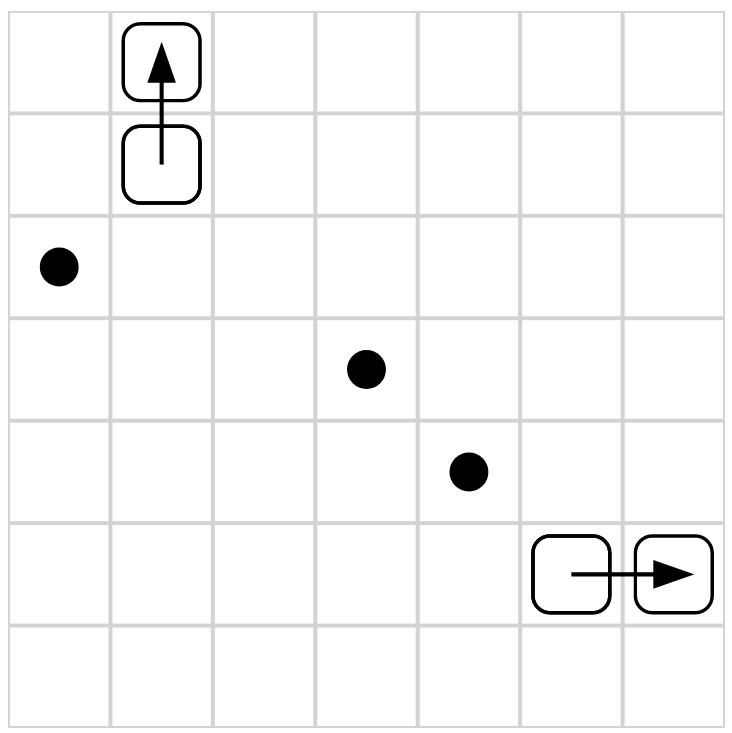

![Built With Stencil](https://img.shields.io/badge/-Built%20With%20Stencil-16161d.svg?logo=data%3Aimage%2Fsvg%2Bxml%3Bbase64%2CPD94bWwgdmVyc2lvbj0iMS4wIiBlbmNvZGluZz0idXRmLTgiPz4KPCEtLSBHZW5lcmF0b3I6IEFkb2JlIElsbHVzdHJhdG9yIDE5LjIuMSwgU1ZHIEV4cG9ydCBQbHVnLUluIC4gU1ZHIFZlcnNpb246IDYuMDAgQnVpbGQgMCkgIC0tPgo8c3ZnIHZlcnNpb249IjEuMSIgaWQ9IkxheWVyXzEiIHhtbG5zPSJodHRwOi8vd3d3LnczLm9yZy8yMDAwL3N2ZyIgeG1sbnM6eGxpbms9Imh0dHA6Ly93d3cudzMub3JnLzE5OTkveGxpbmsiIHg9IjBweCIgeT0iMHB4IgoJIHZpZXdCb3g9IjAgMCA1MTIgNTEyIiBzdHlsZT0iZW5hYmxlLWJhY2tncm91bmQ6bmV3IDAgMCA1MTIgNTEyOyIgeG1sOnNwYWNlPSJwcmVzZXJ2ZSI%2BCjxzdHlsZSB0eXBlPSJ0ZXh0L2NzcyI%2BCgkuc3Qwe2ZpbGw6I0ZGRkZGRjt9Cjwvc3R5bGU%2BCjxwYXRoIGNsYXNzPSJzdDAiIGQ9Ik00MjQuNywzNzMuOWMwLDM3LjYtNTUuMSw2OC42LTkyLjcsNjguNkgxODAuNGMtMzcuOSwwLTkyLjctMzAuNy05Mi43LTY4LjZ2LTMuNmgzMzYuOVYzNzMuOXoiLz4KPHBhdGggY2xhc3M9InN0MCIgZD0iTTQyNC43LDI5Mi4xSDE4MC40Yy0zNy42LDAtOTIuNy0zMS05Mi43LTY4LjZ2LTMuNkgzMzJjMzcuNiwwLDkyLjcsMzEsOTIuNyw2OC42VjI5Mi4xeiIvPgo8cGF0aCBjbGFzcz0ic3QwIiBkPSJNNDI0LjcsMTQxLjdIODcuN3YtMy42YzAtMzcuNiw1NC44LTY4LjYsOTIuNy02OC42SDMzMmMzNy45LDAsOTIuNywzMC43LDkyLjcsNjguNlYxNDEuN3oiLz4KPC9zdmc%2BCg%3D%3D&colorA=16161d&style=flat-square)

# Bhumba Board

This is a web component library for rendering visualizations of [Battlesnake][battlesnake] board states.

It is purpose-built for some of my own Battlesnake projects and experiments, and as such may not be very customizable or useful to others.

## Screenshot



## Status

This project is experimental and your milage may vary.

## Components

- [bhumba-board](src/components/bhumba-board/readme.md)

## Architecture

Bhumba Board is built using [Stencil][stencil].

Stencil is a compiler for building fast web apps using Web Components.

Stencil combines the best concepts of the most popular frontend frameworks into a compile-time rather than run-time tool.  Stencil takes TypeScript, JSX, a tiny virtual DOM layer, efficient one-way data binding, an asynchronous rendering pipeline (similar to React Fiber), and lazy-loading out of the box, and generates 100% standards-based Web Components that run in any browser supporting the Custom Elements v1 spec.

Stencil components are just Web Components, so they work in any major framework or with no framework at all.

## How to Build

```shell
npm install
npm run build
```

## How to Test

### Run Tests Once

```shell
npm run test
```

### Reload Tests When Files Change

```shell
npm run test-watch
```

## How to Preview in Development Server

```shell
npm start
```

## How to Use

See the source code of [src/index.html](src/index.html) for an example of how to use the bhumba-board component in a web page and how to set its board state using JavaScript. This is the same page which is served when you run `npm start`.

See [Components](#components) for component-specific documentation.

The [build script](#how-to-build) provides output in various formats in the `dist` directory. Refer to [Stencil][stencil]'s documentation for how to import the components in your own application.

This project is not yet published as a pre-built package.

### Example Using NPM Link (Just for Testing)

1. In the bhumba-board source root directory, run `npm link`
2. In the consuming app's source root directory, run `npm link bhumba-board --save-dev`
3. Add something like the following to the consuming app's HTML head:

```html
<script type="module" src="./node_modules/bhumba-board/dist/bhumba-board/bhumba-board.esm.js"></script>
<script nomodule src="./node_modules/bhumba-board/dist/cjs/bhumba-board.cjs.js"></script>
```

## Open Invite

If you have any questions, or just wish to geek out and chat about Battlesnake
feel free to reach out!

If you're using this library for a project, I'd love to hear about it.

You can reach me at [xtagon@gmail.com](mailto:xtagon@gmail.com), or catch me in
[Battlesnake Discord][battlesnake-discord] (username: `@xtagon`).

## License

This project is released under the terms of the [MIT License](LICENSE.txt).

[battlesnake]: https://play.battlesnake.com/
[battlesnake-discord]: https://play.battlesnake.com/discord/
[stencil]: https://stenciljs.com/
